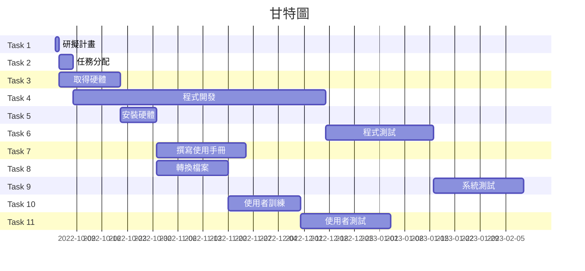

---

```mermaid
gantt
    title 甘特圖
    dateFormat  YYYY-MM-DD
    section Task 1
    研擬計畫 :t1 , 2022-10-03 , 1d
    section Task 2
    任務分配 :t2 , after t1 , 4d
    section Task 3
    取得硬體 :t3 , after t1 , 17d
    section Task 4
    程式開發 :t4 , after t2 , 70d
    section Task 5
    安裝硬體 :t5 , after t3 , 10d
    section Task 6
    程式測試 :t6 , after t4 , 30d
    section Task 7
    撰寫使用手冊 :t7 , after t5 , 25d
    section Task 8
    轉換檔案 :t8 , after t5 , 20d
    section Task 9
    系統測試 :t9 , after t6 , 25d
    section Task 10
    使用者訓練 :t10 , after t8 , 20d
    section Task 11
    使用者測試 :t11 , after t10 , 25d
```
---

### 關鍵路徑:1→3→5→7→10→11
